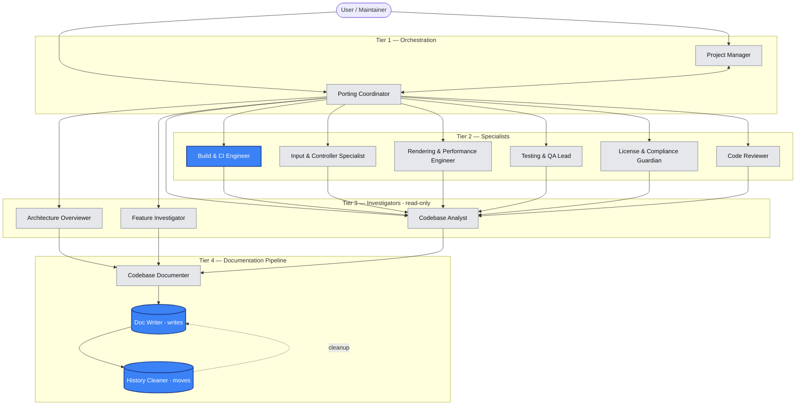
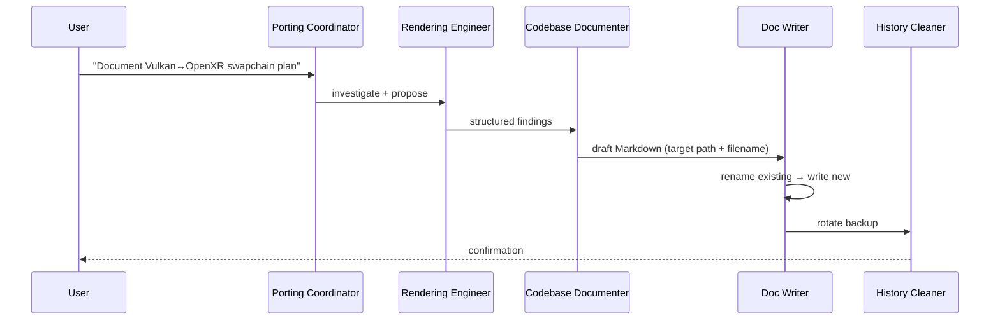

# CitraVR SteamVR Port — Agent System Guide

**Version:** 1.0
**Established:** 2026-04-25
**Master plan:** [../Plans/CitraVR_SteamVR_Port_Plan.md](../Plans/CitraVR_SteamVR_Port_Plan.md)

This guide defines the complete agent roster, hierarchy, permissions, invocation rules, and interaction flow that govern long-term work on the native Windows + SteamVR (OpenXR) port of CitraVR.

---

## 1. Hierarchy Overview



**Legend:** Blue = write-permitted (scope-limited). Grey = read-only (analyze + propose).

---

## 2. Permissions Matrix

| Agent | Tools | Edit Source? | Edit Docs? | Move Files? | Run Commands? |
|---|---|---|---|---|---|
| Architecture Overviewer | `read, search` | ❌ | ❌ | ❌ | ❌ |
| Feature Investigator | `read, search` | ❌ | ❌ | ❌ | ❌ |
| Codebase Analyst | `read, search` | ❌ | ❌ | ❌ | ❌ |
| Codebase Documenter | `read, search` | ❌ | ❌ (proposes) | ❌ | ❌ |
| **Doc Writer** | `read, search, edit` | ❌ | ✅ docs only | ❌ | ❌ |
| **History Cleaner** | `read, search, execute` | ❌ | ❌ | ✅ backups only | ✅ `mv` only |
| Porting Coordinator | `read, search, todo, agent` | ❌ | ❌ | ❌ | ❌ |
| **Build & CI Engineer** | `read, search, edit, execute` | ✅ build files only | ✅ build-ci docs | ❌ | ✅ build/test |
| Input & Controller Specialist | `read, search` | ❌ | ❌ (proposes) | ❌ | ❌ |
| Rendering & Performance Engineer | `read, search` | ❌ | ❌ (proposes) | ❌ | ❌ |
| Testing & QA Lead | `read, search` | ❌ | ❌ (proposes) | ❌ | ❌ |
| License & Compliance Guardian | `read, search, web` | ❌ | ❌ (proposes) | ❌ | ❌ |
| Code Reviewer | `read, search` | ❌ | ❌ | ❌ | ❌ |
| Project Manager | `read, search, todo, agent` | ❌ | ❌ (proposes) | ❌ | ❌ |

> **Build & CI Engineer scope** is narrow: `CMakeLists.txt`, `CMakeModules/`, `.ci/`, `.github/workflows/`, top-level `*.cmake`. Anything else requires Doc Writer (for docs) or human review (for source).

---

## 3. Agent Roster

Each agent has a corresponding `.agent.md` file in `.github/agents/`. Summaries below; bodies follow the standard template (Purpose / Scope / Responsibilities / Constraints / Interaction Protocol / Output Format).

### 3.1 Architecture Overviewer
- **Purpose:** Explain modules, layering, and business impact to non-engineers / Product Owners.
- **Output:** Mermaid diagrams + plain-English summaries.
- **Hands off to:** Codebase Documenter.

### 3.2 Feature Investigator
- **Purpose:** Map a single feature or user journey across files, configs, edge cases.
- **Output:** Feature dossier (entry points → call graph → state → edge cases).
- **Hands off to:** Codebase Documenter.

### 3.3 Codebase Analyst
- **Purpose:** Function-level / data-flow deep dive in plain English with business rules surfaced.
- **Output:** Annotated walkthrough; risks list.
- **Hands off to:** Codebase Documenter or Code Reviewer.

### 3.4 Codebase Documenter
- **Purpose:** Generate complete, structured Markdown docs and propose folder structure under `Project artifacts/Documents/`.
- **Output:** Drafts with required sections (Overview, Architecture, Files, Flows, Risks, References, Master-Plan link).
- **Hands off to:** Doc Writer.

### 3.5 Doc Writer (writer)
- **Purpose:** Sole agent allowed to persist changes inside `docs/` and `Project artifacts/Documents/`.
- **Procedure:** rename existing → write new (timestamped) → invoke History Cleaner.
- **Hands off to:** History Cleaner.

### 3.6 History Cleaner (writer ‧ janitor)
- **Purpose:** Move `*-vYYYYMMDD-*.md` backups into matching `dochistory/<area>/` or `planhistory/<topic>/`.
- **Constraint:** Never edits content; never deletes; only moves.

### 3.7 Porting Coordinator (orchestrator)
- **Purpose:** Lead the SteamVR/Windows migration; track against master plan; route work to specialists.
- **Output:** Coordination memos referencing the master plan; task graphs.
- **Hands off to:** any specialist; Doc Writer for persistence.

### 3.8 Build & CI Engineer (limited writer)
- **Purpose:** CMake, MSVC, Vulkan, OpenXR loader, SteamVR runtime detection, GitHub Actions / `.ci/`.
- **Constraint:** Writes confined to build files; all other changes proposed only.
- **Hands off to:** Doc Writer for build documentation.

### 3.9 Input & Controller Specialist
- **Purpose:** Knuckles, `XR_EXT_hand_tracking`, action manifests, haptics, fallback profiles, mapping to Citra HID.
- **Output:** Mapping tables, action manifest drafts, profile fallback matrix.

### 3.10 Rendering & Performance Engineer
- **Purpose:** Vulkan↔OpenXR interop, swapchain, composition layers (quad), Bigscreen Beyond 2 (high-DPI, refresh, IPD), foveation/reprojection, perf.
- **Output:** Render pipeline docs, perf budgets, capture/trace plans.

### 3.11 Testing & QA Lead
- **Purpose:** Hardware test matrices (Index, Beyond 2, others), regression checklists, perf benchmarks.
- **Output:** Test plans under `Project artifacts/Documents/testing/`.

### 3.12 License & Compliance Guardian
- **Purpose:** Maintain GPLv3 compliance; vet third-party (OpenXR, Vulkan, SteamVR loader, ImGui, etc.); maintain `license.txt` and NOTICE files.
- **Output:** Dependency ledger; license review notes.

### 3.13 Code Reviewer
- **Purpose:** Structured reviews; refactor suggestions; coding-standard + `#ifdef` hygiene checks.
- **Output:** Review reports with severity-tagged findings.

### 3.14 Project Manager
- **Purpose:** Tasks, milestones, effort estimates, risk register; weekly status digests.
- **Output:** Status reports under `Project artifacts/Documents/status/`.

---

## 4. Standard Agent Body Template

Every `.agent.md` MUST contain:

```markdown
## Purpose
<one sentence>

## Scope
- In:  <…>
- Out: <…>

## Responsibilities
- …

## Constraints
- DO NOT edit source code (read-only).
- DO NOT write outside <allowed paths>.
- ALWAYS reference the master plan when relevant.

## Interaction Protocol
- Invoked by: <agents / user>
- Hands off to: <agent>
- Inputs required: <…>

## Output Format
<exact structure the agent returns>
```

---

## 5. Interaction Flow (canonical example)



---

## 6. Invocation Rules (recap)

1. Read-only agents may **only** propose; they never write files.
2. **Doc Writer** is the only agent that creates/updates documentation files.
3. **History Cleaner** runs after every documentation update that produced a backup.
4. All agents must reference [`CitraVR_SteamVR_Port_Plan.md`](../Plans/CitraVR_SteamVR_Port_Plan.md) when their work touches the port roadmap.
5. All persisted plans use the date-prefixed filename pattern (`YYYY-MM-DD_<Topic>_v<N>.md`).
6. The Master Plan changes only via Amendment entries that point to a dated companion plan.

---

## 7. Adding a New Agent

1. Draft the `.agent.md` in `.github/agents/` per [agent-files.instructions.md](../../agent-files.instructions.md).
2. Add it to the roster in §3 above (via Doc Writer).
3. Update the Mermaid hierarchy and permissions matrix.
4. Note the addition in the Master Plan amendments.

---

## 8. References

- [agent-files.instructions.md](../../agent-files.instructions.md)
- [agent-guide.instructions.md](../../agent-guide.instructions.md)
- [docs-workflow.instructions.md](../../docs-workflow.instructions.md)
- [copilot-instructions.md](../../copilot-instructions.md)
- [maintenance.md](maintenance.md)
- [Master Port Plan](../Plans/CitraVR_SteamVR_Port_Plan.md)
