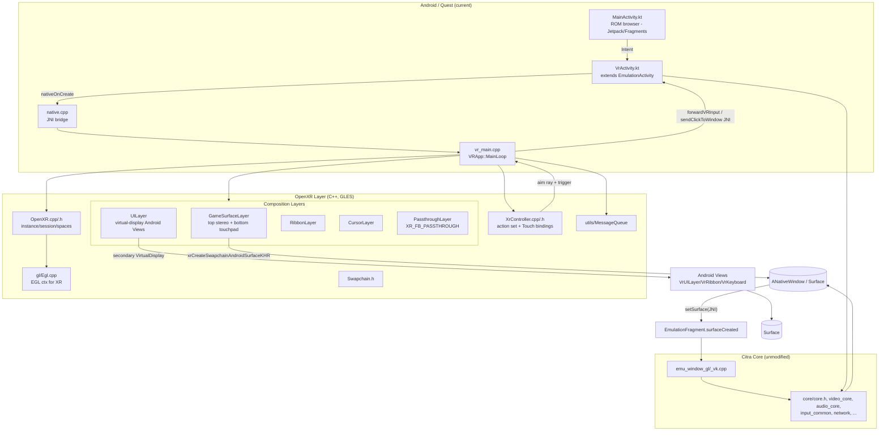

# CitraVR → SteamVR (Windows) Port Plan & Architecture Audit

> Source repository: `g:/Citra VR PC Port` (fork of [amwatson/CitraVR](https://github.com/amwatson/CitraVR))
> Target: Native OpenXR application on Windows running under the SteamVR runtime, with full support for **Valve Index Knuckles** controllers and **Bigscreen Beyond 2** HMD.
> Document date: 2026-04-25

---

## Table of Contents

1. [Task 1 — Repository Evaluation & Architecture](#task-1--repository-evaluation--architecture)
   - [1.1 High-level architecture (Mermaid)](#11-high-level-architecture)
   - [1.2 Core modules and responsibilities](#12-core-modules-and-responsibilities)
   - [1.3 Data flow: ROM → emulation → stereoscopic VR](#13-data-flow)
   - [1.4 Rendering pipeline specifics](#14-rendering-pipeline-specifics)
   - [1.5 Input system specifics](#15-input-system-specifics)
   - [1.6 Build system / dependencies / platform code](#16-build-system--dependencies--platform-code)
   - [1.7 Key files / folders](#17-key-files--folders-implementing-vr-features)
2. [Task 2 — Native SteamVR Port Plan (Windows)](#task-2--native-steamvr-windows-port-plan)
   - [2.0 Goals & runtime topology](#20-goals--runtime-topology)
   - [2.1 Migration plan (step-by-step)](#21-migration-plan-step-by-step)
   - [2.2 Breaking changes / major refactors](#22-breaking-changes--major-refactors)
   - [2.3 Effort estimate & risk](#23-effort-estimate--risk)
   - [2.4 Prioritised file/module change order](#24-prioritised-filemodule-change-order)
   - [2.5 Sample code snippets](#25-sample-code-snippets)
   - [2.6 Bonus — gotchas & performance tips](#26-bonus--gotchas--performance-tips)

---

# Task 1 — Repository Evaluation & Architecture

## 1.1 High-level architecture



## 1.2 Core modules and responsibilities

VR-specific code lives almost entirely in `src/android/app/src/main/jni/vr/` and the Kotlin shim under `src/android/app/src/main/java/org/citra/citra_emu/vr/`. The rest of the tree is upstream Citra.

| Concern | File(s) | Notes |
|---|---|---|
| Activity / lifecycle | `VrActivity.kt`, `VrCitraApplication.kt` | Subclasses `EmulationActivity`; calls `nativeOnCreate()` → spawns the VR thread. Provides JNI callbacks `forwardVRInput`, `forwardVRJoystick`, `sendClickToWindow`, `pauseGame`, `resumeGame`, `openSettingsMenu`, `quitToMenu`. |
| ROM list / launching | `MainActivity.kt`, `viewmodel/HomeViewModel.kt`, `GamesViewModel.kt`, `EmulationActivity.kt`, `EmulationFragment.kt` | Standard Citra-Android Jetpack flow. The fragment owns the rendering `Surface`. |
| JNI bridge | `native.cpp` | `RunCitra(filepath)` is the entry into core. Note `s_should_release_surface = false` in VR (the Surface comes from XR, not the SurfaceView). |
| OpenXR init / runtime | `OpenXR.cpp` / `.h` | Loads GLES OpenXR runtime via `xrInitializeLoaderKHR` (Android trampoline). Required ext list: `XR_KHR_OPENGL_ES_ENABLE`, `XR_EXT_PERFORMANCE_SETTINGS`, `XR_KHR_ANDROID_THREAD_SETTINGS`, `XR_KHR_COMPOSITION_LAYER_EQUIRECT2`, `XR_KHR_ANDROID_SURFACE_SWAPCHAIN`, `XR_FB_COMPOSITION_LAYER_SETTINGS`, `XR_FB_PASSTHROUGH`, `XR_META_PERFORMANCE_METRICS`. Holds `mInstance`, `mSession`, `mSystemId`, `mLocalSpace`, `mStageSpace`, `mHeadSpace`, `mViewSpace`, `mForwardDirectionSpace`, two `XrViewConfigurationView`s (stereo). |
| EGL context | `gl/Egl.cpp` / `.h` | Creates the GLES3 context bound to the XR session via `XrGraphicsBindingOpenGLESAndroidKHR`. Uses a dummy `EGLSurface` because the device lacks `EGL_KHR_surfaceless_context`. |
| Frame loop / state machine | `vr_main.cpp` (~1.7k LOC) | `class VRApp` runs on its own thread. `MainLoop()` → `HandleEvents`/`HandleStateChanges`/`Frame`. `Frame()` does `xrWaitFrame`/`xrBeginFrame` → builds `std::vector<XrCompositionLayer>` → `xrEndFrame`. Implements "Super Immersive" mode (`vr_immersive_mode`), the mixed-reality passthrough environment, Citra resume/pause forwarding, and Quest performance hints (`XR_PERF_SETTINGS_LEVEL_BOOST_EXT`). |
| Compositor layers | `layers/GameSurfaceLayer.cpp`, `UILayer.cpp`, `RibbonLayer.cpp`, `CursorLayer.cpp`, `PassthroughLayer.cpp` | The crown jewel. See §1.4. |
| XR input | `XrController.cpp` / `.h` | One action set `citra_controls`, hard-coded interaction profile `/interaction_profiles/oculus/touch_controller`. Actions: A/B/X/Y, left menu, left/right index trigger, thumbstick (vec2 + click), thumbrest touch, squeeze trigger, aim pose. **No haptics, no skeletal/grip-curl.** |
| Settings | `vr_settings.cpp` / `.h` | `VRSettings::values`: `hmd_type` (Quest1/2/3/3S/Pro), `resolution_factor`, `vr_environment` (PASSTHROUGH/VOID), `vr_immersive_mode` (0/1/2 → factor 1/3/1.4), `vr_factor_3d`, `vr_si_mode_register_offset`, etc. |
| JNI utilities | `utils/JniClassNames.cpp`, `JniUtils.cpp`, `MessageQueue.cpp`, `SyspropUtils.h`, `XrMath.h` | `MessageQueue` carries asynchronous events from Java to the VR thread. `SyspropUtils` reads Android `debug.citra.*` system properties at runtime. |
| Build (Android) | `src/android/app/src/main/jni/CMakeLists.txt` | Adds `vr/*` sources to `citra-android` shared lib, links `openxr_loader`, `GLESv3`, `mediandk`, `EGL`. Driven by Gradle/NDK. |

## 1.3 Data flow

ROM → emulation → stereoscopic VR:

1. `MainActivity` (Jetpack `GamesViewModel`) lists ROMs via SAF (`DocumentsTree`, `DocumentFile.fromTreeUri`).
2. User picks a game → `EmulationActivity` is started; in VR builds, the manifest routes through `VrActivity` (`org.citra.citra_emu.vr.VrActivity`).
3. `VrActivity.onCreate()` → `nativeOnCreate()` (in `vr_main.cpp`) → starts a dedicated thread that runs `VRApp::MainLoop`.
4. `OpenXr::Init` creates instance/session/spaces and the EGL/GLES context.
5. `GameSurfaceLayer` creates an **Android-surface-backed swapchain** (`xrCreateSwapchainAndroidSurfaceKHR`) at `SURFACE_WIDTH_UNSCALED * resolutionFactor` × `SURFACE_HEIGHT_UNSCALED * resolutionFactor` and gets back an `ANativeWindow*`.
6. `GameSurfaceLayer::SetSurface()` JNIs back into `org.citra.citra_emu.vr.GameSurfaceLayer.setSurface(activity, surface)` which calls `EmulationFragment.surfaceCreated(surface)` → Citra's `EmuWindow_Android` (in `emu_window_gl.cpp`/`emu_window_vk.cpp`) treats it as the normal display surface.
7. Citra renders the 3DS frame into that Surface laid out as:

   ```
   +---------+---------+   top:   left-eye 400x240   |  right-eye 400x240
   |  L top  |  R top  |
   +-+-----+-+-+-----+-+   bot:   left-eye 320x240   |  right-eye 320x240
     | L bot |  | R bot |
     +-------+  +-------+
   ```
   (See ASCII diagram in `GameSurfaceLayer.h` header.)
8. Per XR frame, `VRApp::Frame()` builds an ordered layer stack:
   - `XrCompositionLayerPassthroughFB` (if MR enabled),
   - top quad/cylinder stereo layer (uses left half / right half of the surface as `XrSwapchainSubImage` per eye),
   - bottom touchpad quad,
   - `RibbonLayer` (UI ribbon),
   - `UILayer` instances (keyboard / error popup),
   - `CursorLayer` for the controller pointer.
   Then `xrEndFrame` with `XR_ENVIRONMENT_BLEND_MODE_OPAQUE`.
9. **Input**: `InputStateFrame::SyncButtonsAndThumbSticks` runs each frame; results are forwarded via `forwardVRInput(keycode,bool)` and `forwardVRJoystick(x,y,type)` JNI calls into `VrActivity`, which dispatches them as Android `KeyEvent`s on `SOURCE_GAMEPAD` so the existing Citra Android input layer (`input_manager.cpp`) receives them transparently. UI clicks come from raycasting the controller aim pose against each layer's plane and JNI-dispatching `MotionEvent`s via `sendClickToWindow`.

## 1.4 Rendering pipeline specifics

- **Stereoscopy**: not a `XR_TYPE_COMPOSITION_LAYER_PROJECTION`. Instead two `XrCompositionLayerQuad` (or `Cylinder`/`Equirect2`) instances per eye, each with `XrSwapchainSubImage` selecting the left or right half of the same Android surface. The 3DS GPU itself produces the stereo pair via the Citra renderer's existing 3D depth feature (`vr_factor_3d`). This guarantees per-eye sub-pixel sharpness on the compositor side.
- **Layer count**: capped by `OpenXr::mMaxLayerCount` (Quest reports 16). Composition layer order = depth order (passthrough → top → ribbon → bottom → keyboard → error → cursor).
- **Resolution scaling**: `GetDefaultGameResolutionFactorForHmd` → 3× for Quest3, else 2×; immersive mode adds +2; final image dimensions are `SURFACE_WIDTH_UNSCALED(800) * factor × SURFACE_HEIGHT_UNSCALED(480) * factor`.
- **Sharpening**: `XR_FB_COMPOSITION_LAYER_SETTINGS_EXTENSION_NAME` is used to flag layers as sharp text/UI.
- **Performance hints**: `xrPerfSettingsSetPerformanceLevelEXT` set CPU/GPU to `BOOST_EXT`; render thread elevated via `xrSetAndroidApplicationThreadKHR(RENDERER_MAIN_KHR)`.
- **No depth buffer** is submitted (quads only) — there is no projection layer in this app.

## 1.5 Input system specifics

Bindings in `XrController.cpp` are hard-coded to `oculus/touch_controller`:

```
A,B,X,Y .click       -> Citra A/B/X/Y
left menu .click     -> toggles in-game ribbon
left/right trigger   -> "primary fire" (UI raycast click)
left/right squeeze/value -> BUTTON_L1 / BUTTON_R1
left/right thumbstick -> joystick (LEFT stick + C-stick)
thumbstick/click     -> dpad-mode latch (held to convert stick to dpad)
thumbrest/touch      -> selects which stick acts as dpad
aim/pose             -> ray for cursor & UI hit-test
```

DPad is synthesised from a thumbstick when the *other* hand's thumbrest is touched. There are **no haptics** and no skeletal/curl input. Preferred hand is auto-selected (last active).

## 1.6 Build system / dependencies / platform code

- Top-level `CMakeLists.txt` — generic Citra build. The `src/CMakeLists.txt` adds the `android/` subtree only when `ANDROID`. There is **no Windows/Linux/Mac build path that includes the VR code today.**
- VR module pulled in via `src/android/app/src/main/jni/CMakeLists.txt` which adds the `vr/...` translation units and links `openxr_loader`, `GLESv3`, `EGL`, `mediandk`.
- OpenXR SDK is vendored under `externals/openxr-sdk-src/` (Khronos loader, Apache-2.0). The Quest-specific runtime is loaded indirectly through Khronos' broker (see the manifest's `org.khronos.openxr.permission.OPENXR_SYSTEM` and the GPL "system library" exemption comment in `AndroidManifest.xml`).
- **Hard Quest dependencies in code**:
  - `XR_USE_PLATFORM_ANDROID`, `XR_USE_GRAPHICS_API_OPENGL_ES` everywhere (`OpenXR.h`, `XrController.h`).
  - `xrSetAndroidApplicationThreadKHR`, `XrLoaderInitInfoAndroidKHR`, `XR_KHR_ANDROID_THREAD_SETTINGS`, `XR_KHR_ANDROID_SURFACE_SWAPCHAIN`.
  - `XR_FB_PASSTHROUGH`, `XR_FB_COMPOSITION_LAYER_SETTINGS`, `XR_META_PERFORMANCE_METRICS` (Meta-only).
  - `oculus/touch_controller` interaction profile only.
  - JNI everywhere (`mActivityObject`, `JNIEnv*`).
  - Surface-backed swapchains for all UI/game rendering (Android-only).
  - HMD enum tied to Quest models (`VRSettings::HMDType`).

## 1.7 Key files / folders implementing VR features

```
src/android/app/src/main/jni/vr/
├── OpenXR.{h,cpp}                 # XR instance/session/spaces (GLES + Android)
├── XrController.{h,cpp}           # Action set + Quest Touch bindings
├── Swapchain.h                    # tiny POD wrapper
├── vr_main.cpp                    # VRApp thread, frame loop, state machine
├── vr_settings.{h,cpp}            # VRSettings::values
├── gl/Egl.{h,cpp}                 # EGL/GLES context for XR
├── layers/
│   ├── GameSurfaceLayer.{h,cpp}   # Stereo 3DS panels (Android-surface swapchain)
│   ├── UILayer.{h,cpp}            # Generic Android-View-on-virtual-display layer
│   ├── RibbonLayer.{h,cpp}        # Bottom HUD ribbon
│   ├── CursorLayer.{h,cpp}        # Controller cursor sprite
│   └── PassthroughLayer.{h,cpp}   # XR_FB_PASSTHROUGH
└── utils/{JniClassNames,JniUtils,MessageQueue,SyspropUtils,XrMath,LogUtils,Common}.{h,cpp}

src/android/app/src/main/java/org/citra/citra_emu/vr/
├── VrActivity.kt, VrCitraApplication.kt, GameSurfaceLayer.kt
├── ui/{VrUILayer,VrRibbonLayer,VrKeyboardLayer,VrErrorMessageLayer,VrKeyboardView}.kt
└── utils/VRUtils.kt
```

---

# Task 2 — Native SteamVR (Windows) Port Plan

The OpenXR API surface used in `vr_main.cpp` is largely portable; the platform glue (Android Surface, EGL/GLES, JNI, Quest-only extensions, Oculus Touch profile) is not. The plan below treats the existing tree as a starting point and adds a parallel `vr_platform/` module that replaces the Android-specific bottom half.

## 2.0 Goals & runtime topology

- **Target**: Windows 10/11 x64, OpenXR loader (Khronos) + SteamVR runtime (`SteamVR/bin/win64/vrclient_x64.dll` is auto-discovered via the `OpenXR runtime` registry key SteamVR sets when made active).
- **Frontend**: keep `citra_qt` as the ROM browser (it already builds on Windows). Boot into VR after the user double-clicks a game, exactly the way the Android port boots into `VrActivity` after selecting a ROM.
- **Renderer**: Vulkan (Citra already supports it via `emu_window_vk.cpp` and `vma`). On Windows we cannot use surface-backed swapchains, so we render to off-screen `VkImage`s and **blit/sample them into XR Vulkan swapchains**.
- **HMD**: Bigscreen Beyond 2 (≈3840×3552 per eye native, OLED, ~90/75 Hz, no on-board tracking — uses Lighthouse 2.0 base stations and SteamVR-tracked controllers).
- **Controllers**: Valve Index Knuckles via `/interaction_profiles/valve/index_controller` + skeletal input (`XR_EXT_hand_tracking` over SteamVR's emulation, *or* OpenVR's `IVRInput` skeleton — we'll use the OpenXR `EXT_hand_tracking` + `/input/grip` curls path so we stay 100 % OpenXR).

## 2.1 Migration plan (step-by-step)

### Step 1 — Reorganise platform code

Create a new abstraction so VR code is no longer Android-only:

```
src/vr_platform/
├── IVrPlatform.h            # interface: instance/session/swapchain/input
├── android/                 # MOVE existing JNI/EGL bits here (no behaviour change)
└── windows/
    ├── WinPlatform.{h,cpp}  # win32 hwnd, Vulkan/D3D12 binding, no JNI
    ├── VkXrSwapchain.{h,cpp}# replaces Android-surface swapchain
    └── ImGuiOverlay.{h,cpp} # replaces UILayer (no Android Views)
```

Hoist platform-agnostic code from `vr_main.cpp` (frame loop, layer composition order, Super-Immersive math, cursor logic) into `src/vr_platform/VrApp.cpp`. Keep `vr_main.cpp` as the Android entrypoint only.

### Step 2 — CMake changes

In root `CMakeLists.txt`, add:

```cmake
option(ENABLE_VR "Build VR (OpenXR) support"        OFF)
option(VR_BACKEND_STEAMVR "Build SteamVR/Windows VR backend" OFF)
if (ENABLE_VR AND WIN32)
    set(VR_BACKEND_STEAMVR ON CACHE BOOL "" FORCE)
endif()
```

Always include `externals/openxr-sdk-src` (Apache-2.0 — already vendored). Build the `openxr_loader` static target on Windows. Add `add_subdirectory(src/vr_platform)` and link the produced `vr_platform_pcvr` into `citra-qt` (and a new `citra_vr` exe if desired). Require `ENABLE_VULKAN=ON` and disable `ENABLE_SOFTWARE_RENDERER` for VR builds. Drop `find_package(JNI)` and `EGL`/`GLESv3` from the new target.

Minimal target snippet:

```cmake
add_library(vr_platform_pcvr STATIC
    VrApp.cpp VrApp.h
    windows/WinPlatform.cpp
    windows/VkXrSwapchain.cpp
    windows/ImGuiOverlay.cpp
    XrController.cpp                 # refactored, no JNI
    layers/GameQuadLayer.cpp         # ex-GameSurfaceLayer, Vulkan swapchain
    layers/CursorLayer.cpp
    layers/UIQuadLayer.cpp           # ex-UILayer, ImGui-backed
)
target_compile_definitions(vr_platform_pcvr PUBLIC
    XR_USE_GRAPHICS_API_VULKAN=1
    XR_USE_PLATFORM_WIN32=1
    VR_BACKEND_STEAMVR=1)
target_link_libraries(vr_platform_pcvr PUBLIC
    openxr_loader Vulkan::Vulkan citra_core video_core common imgui)
```

### Step 3 — Strip / port the Android-specific layer

| Replace | With |
|---|---|
| `XR_USE_GRAPHICS_API_OPENGL_ES` / `XR_USE_PLATFORM_ANDROID` in `OpenXR.h`, `XrController.h` | `XR_USE_GRAPHICS_API_VULKAN`, `XR_USE_PLATFORM_WIN32` |
| `EglContext` (`gl/Egl.cpp`) | Reuse Citra's existing `VkInstance`/`VkDevice` from `video_core/renderer_vulkan`. Use `XrGraphicsBindingVulkanKHR`. |
| `xrInitializeLoaderKHR` (Android trampoline) | Not needed on Windows. |
| `XR_KHR_ANDROID_SURFACE_SWAPCHAIN` (used in `GameSurfaceLayer::CreateSwapchain` and `UILayer::CreateSwapchain`) | Standard `xrCreateSwapchain` + `xrEnumerateSwapchainImages` returning `VkImage` array. Citra renders to an *intermediate* `VkImage` and the app blits per-eye sub-rectangles into the XR swapchain images each frame. |
| `xrSetAndroidApplicationThreadKHR` perf-pinning, `XR_KHR_ANDROID_THREAD_SETTINGS`, `XR_EXT_PERFORMANCE_SETTINGS`, `XR_META_PERFORMANCE_METRICS` (in `vr_main.cpp` `kGpuPerfLevel`, `vr_settings.cpp`) | Drop. SteamVR ignores these. Use `SetThreadPriority(GetCurrentThread(), THREAD_PRIORITY_TIME_CRITICAL)` for the render thread. |
| `XR_FB_PASSTHROUGH` (`PassthroughLayer.cpp`) | Remove. Beyond 2 has no passthrough. Replace `VRSettings::values.vr_environment` choices with a procedural skybox in a Vulkan-rendered projection layer (see §2.1.4) or a static cubemap. |
| `XR_FB_COMPOSITION_LAYER_SETTINGS` (sharp-text flag) | Drop or guard with `xrEnumerateInstanceExtensionProperties`. SteamVR does not implement it; image fidelity comes from native pancake clarity instead. |
| All `JNIEnv*`, `jobject`, `mActivityObject`, `forwardVRInput` / `sendClickToWindow` JNI calls in `vr_main.cpp`, `XrController.cpp`, `GameSurfaceLayer.cpp`, `UILayer.cpp` | Direct C++ calls into Citra's `Frontend::EmuWindow`, `InputCommon`, and an `ImGuiOverlay` for in-VR UI. |
| `org.citra.citra_emu.vr.*` Kotlin (`VrActivity`, `VrUILayer`, `VrRibbonLayer`, `VrKeyboardLayer`, `GameSurfaceLayer.kt`) | Delete from the Windows build (`if (NOT ANDROID)` exclude). UI moves to ImGui (see §2.1.7). |
| `oculus/touch_controller` bindings in `XrController.cpp` | Add `valve/index_controller` profile (keep Touch as fallback, see §2.1.5). |
| `VRSettings::HMDType` enum (Quest1/2/3/Pro/3S) | Add `BIGSCREEN_BEYOND_2`, `VALVE_INDEX`, `UNKNOWN_PCVR`. Auto-detect via `XrSystemProperties::systemName` substring match. |

### Step 4 — Rendering pipeline for SteamVR + Beyond 2

#### 2.1.4.1 Replace Android-surface trick

The current architecture puts the entire 3DS frame (top-stereo + bottom-mono) into one Android Surface and references sub-rectangles per layer. On Windows do this:

1. Citra renders the 3DS frame to an `EmuWindow_VR_Win` whose backing buffer is an off-screen `VkImage` of size `(800·factor) × (480·factor)`. (Subclass `EmuWindow_Vulkan` analogously to `emu_window_vk.cpp`.)
2. The XR thread owns:
   - Top swapchain `S_top_left` and `S_top_right`, each `400·factor × 240·factor`.
   - Bottom swapchain `S_bot_left` and `S_bot_right`, each `320·factor × 240·factor`.
   - Optionally one combined `S_top_stereo` (`800·factor × 240·factor`) and use `XrSwapchainSubImage` per eye, mirroring today's design 1:1.
3. Each frame: `xrAcquireSwapchainImage` → `vkCmdBlitImage` from Citra's frame to each XR swapchain image with the appropriate source rect → `xrReleaseSwapchainImage`.
4. Submit two `XrCompositionLayerQuad` (top stereo, eye-masked via `subImage.imageRect` and `eyeVisibility`) and two `XrCompositionLayerQuad` (bottom touchpad, mono shown to both eyes), exactly like today's `GameSurfaceLayer::FrameTopPanel` / `FrameLowerPanel`.

#### 2.1.4.2 Resolution / refresh / reprojection (Beyond 2)

- Query `XrViewConfigurationView::recommendedImageRectWidth/Height` — Beyond 2 reports ~`3840 × 3552` per eye. Render Citra's 3DS framebuffer at `factor=4` or `factor=5` (e.g. `4000 × 2400`) — text density is preserved by the quad layer's intrinsic clarity.
- Use `XR_KHR_composition_layer_color_scale_bias` to dim background when desired.
- Refresh-rate selection via `XR_FB_display_refresh_rate` is exposed by SteamVR only when running through the OpenXR-on-OpenVR shim shipped by Valve (1.0.32+). Safe fallback: leave the rate to SteamVR (Beyond 2 default 75/90 Hz).
- Set `XrSwapchainCreateInfo::sampleCount = 1` (already so), `format = VK_FORMAT_B8G8R8A8_SRGB` (enumerate via `xrEnumerateSwapchainFormats`).
- **Foveated rendering**: not yet a stable cross-vendor extension on SteamVR. Skip it. Citra's GPU cost is dominated by shader recompiles, not pixel fill — the Beyond 2's panel cost is borne by SteamVR's compositor doing supersampling on a separate thread.
- **Reprojection**: SteamVR's "Motion Smoothing" works fine with quad-only composition. Aim for native 90 Hz; a dropped frame just freezes the quad (no judder, because there's no projection layer with depth).
- **Performance target**: 90+ FPS sustained at `factor=4`. The 3DS resolution is 400×240, so even 4× supersampling is < 4 MP — trivial on modern PC GPUs. The bottleneck will be the compositor delivering the Beyond 2's huge native image; favour CPU-side single-thread responsiveness over render workload.

### Step 5 — Knuckles input replacement

Replace the entire body of `InputStateStatic::InputStateStatic` in `XrController.cpp`. New action set, including haptics + grip curls, suggested for `valve/index_controller`. Keep the existing `oculus/touch_controller` block as a fallback profile so users on other PCVR HMDs still work.

```cpp
// PCVR XrController.cpp (replacement core)
auto MakeAction = [&](XrActionType t, const char* n, const char* l, int subCount=0,
                      XrPath* sub=nullptr){ /* same as today */ };

mAimPoseAction         = MakeAction(XR_ACTION_TYPE_POSE_INPUT,    "aim_pose",      "Aim",  2, hands);
mGripPoseAction        = MakeAction(XR_ACTION_TYPE_POSE_INPUT,    "grip_pose",     "Grip", 2, hands);
mTriggerValueAction    = MakeAction(XR_ACTION_TYPE_FLOAT_INPUT,   "trigger_value", "Trigger", 2, hands);
mTriggerClickAction    = MakeAction(XR_ACTION_TYPE_BOOLEAN_INPUT, "trigger_click", "Trigger Click", 2, hands);
mSqueezeValueAction    = MakeAction(XR_ACTION_TYPE_FLOAT_INPUT,   "squeeze_value", "Grip Force",    2, hands);
mSqueezeForceAction    = MakeAction(XR_ACTION_TYPE_FLOAT_INPUT,   "squeeze_force", "Grip Force HD", 2, hands);
mThumbstickAction      = MakeAction(XR_ACTION_TYPE_VECTOR2F_INPUT,"thumbstick",    "Thumbstick",    2, hands);
mThumbstickClickAction = MakeAction(XR_ACTION_TYPE_BOOLEAN_INPUT, "thumbstick_click","Thumbstick Click",2,hands);
mThumbstickTouchAction = MakeAction(XR_ACTION_TYPE_BOOLEAN_INPUT, "thumbstick_touch","Thumbstick Touch",2,hands);
mTrackpadAction        = MakeAction(XR_ACTION_TYPE_VECTOR2F_INPUT,"trackpad",      "Trackpad",      2, hands);
mTrackpadForceAction   = MakeAction(XR_ACTION_TYPE_FLOAT_INPUT,   "trackpad_force","Trackpad Force",2, hands);
mTrackpadTouchAction   = MakeAction(XR_ACTION_TYPE_BOOLEAN_INPUT, "trackpad_touch","Trackpad Touch",2, hands);
mAButtonAction         = MakeAction(XR_ACTION_TYPE_BOOLEAN_INPUT, "a_click",       "A");
mBButtonAction         = MakeAction(XR_ACTION_TYPE_BOOLEAN_INPUT, "b_click",       "B");
mSystemAction          = MakeAction(XR_ACTION_TYPE_BOOLEAN_INPUT, "system",        "System", 2, hands);
mHapticAction          = MakeAction(XR_ACTION_TYPE_VIBRATION_OUTPUT,"haptic","Haptic",2,hands);

XrPath profile;
xrStringToPath(instance, "/interaction_profiles/valve/index_controller", &profile);
std::vector<XrActionSuggestedBinding> b = {
  {mAimPoseAction,         StrToPath("/user/hand/left/input/aim/pose")},
  {mAimPoseAction,         StrToPath("/user/hand/right/input/aim/pose")},
  {mGripPoseAction,        StrToPath("/user/hand/left/input/grip/pose")},
  {mGripPoseAction,        StrToPath("/user/hand/right/input/grip/pose")},
  {mTriggerValueAction,    StrToPath("/user/hand/left/input/trigger/value")},
  {mTriggerValueAction,    StrToPath("/user/hand/right/input/trigger/value")},
  {mTriggerClickAction,    StrToPath("/user/hand/left/input/trigger/click")},
  {mTriggerClickAction,    StrToPath("/user/hand/right/input/trigger/click")},
  {mSqueezeValueAction,    StrToPath("/user/hand/left/input/squeeze/value")},
  {mSqueezeValueAction,    StrToPath("/user/hand/right/input/squeeze/value")},
  {mSqueezeForceAction,    StrToPath("/user/hand/left/input/squeeze/force")},
  {mSqueezeForceAction,    StrToPath("/user/hand/right/input/squeeze/force")},
  {mThumbstickAction,      StrToPath("/user/hand/left/input/thumbstick")},
  {mThumbstickAction,      StrToPath("/user/hand/right/input/thumbstick")},
  {mThumbstickClickAction, StrToPath("/user/hand/left/input/thumbstick/click")},
  {mThumbstickClickAction, StrToPath("/user/hand/right/input/thumbstick/click")},
  {mThumbstickTouchAction, StrToPath("/user/hand/left/input/thumbstick/touch")},
  {mThumbstickTouchAction, StrToPath("/user/hand/right/input/thumbstick/touch")},
  {mTrackpadAction,        StrToPath("/user/hand/left/input/trackpad")},
  {mTrackpadAction,        StrToPath("/user/hand/right/input/trackpad")},
  {mTrackpadForceAction,   StrToPath("/user/hand/left/input/trackpad/force")},
  {mTrackpadForceAction,   StrToPath("/user/hand/right/input/trackpad/force")},
  {mTrackpadTouchAction,   StrToPath("/user/hand/left/input/trackpad/touch")},
  {mTrackpadTouchAction,   StrToPath("/user/hand/right/input/trackpad/touch")},
  {mAButtonAction,         StrToPath("/user/hand/right/input/a/click")},
  {mBButtonAction,         StrToPath("/user/hand/right/input/b/click")},
  {mAButtonAction,         StrToPath("/user/hand/left/input/a/click")},  // map to X on 3DS
  {mBButtonAction,         StrToPath("/user/hand/left/input/b/click")},  // map to Y
  {mSystemAction,          StrToPath("/user/hand/left/input/system/click")},
  {mSystemAction,          StrToPath("/user/hand/right/input/system/click")},
  {mHapticAction,          StrToPath("/user/hand/left/output/haptic")},
  {mHapticAction,          StrToPath("/user/hand/right/output/haptic")},
};
XrInteractionProfileSuggestedBinding sb{XR_TYPE_INTERACTION_PROFILE_SUGGESTED_BINDING};
sb.interactionProfile = profile;
sb.suggestedBindings = b.data();
sb.countSuggestedBindings = (uint32_t)b.size();
xrSuggestInteractionProfileBindings(instance, &sb);
```

**Skeletal / finger tracking**: enable `XR_EXT_hand_tracking` (SteamVR exposes it for Knuckles based on capacitive sensors) and create one `XrHandTrackerEXT` per hand. Use `xrLocateHandJointsEXT(...XR_HAND_JOINT_SET_DEFAULT_EXT...)` each frame to draw an articulated hand model in `CursorLayer`'s replacement, and to map "pinch" gestures to UI clicks (so the user can interact even when the controller isn't pointing at a quad).

**Mapping suggestions** (3DS has A/B/X/Y, L/R, Start/Select, Home, dpad, circle pad, c-stick):

- Right A/B → 3DS A/B
- Left A/B → 3DS X/Y
- Trigger (right) → R, Trigger (left) → L (analog, useful for OoT 3D)
- Grip (squeeze) value → ZL/ZR (New3DS), with `force` ≥ 0.5 fully pressed
- Right thumbstick → C-stick; Left thumbstick → Circle pad
- Thumbstick click → toggles dpad-mode (replicates current Quest behaviour)
- Trackpad: top quadrants → dpad up/down/left/right (touch-only, no force needed)
- Right system → Start; Left system → Select (long press for Home)
- "Menu" toggle: pinch + thumb-on-A gesture (via hand-tracking) → opens ImGui ribbon

**Haptics**: replace today's silent button presses with feedback on save/load state, click events, and emulator errors:

```cpp
XrHapticVibration h{XR_TYPE_HAPTIC_VIBRATION};
h.amplitude = 0.5f;  h.duration = 50'000'000; // 50 ms
h.frequency = 320.0f; // matches Index linear actuator
XrHapticActionInfo info{XR_TYPE_HAPTIC_ACTION_INFO};
info.action = mHapticAction; info.subactionPath = rightHand;
xrApplyHapticFeedback(session, &info, (XrHapticBaseHeader*)&h);
```

(Optional) ship a `steamvr_input/citravr_actions.json` action manifest for users who run the legacy SteamVR Input UI bindings editor — but with pure OpenXR you can avoid it.

### Step 6 — Bigscreen Beyond 2 specifics

- **No on-board controllers, no microphone, no audio out** — route audio through Citra's normal output (`SDL2`/`cubeb`) on the user's default Windows device. Don't rely on `XR_KHR_visibility_mask` to gate UI.
- **No pass-through camera** — delete the `PassthroughLayer` code-path entirely (set `vr_environment = VOID` always).
- **High-res panels**: the Beyond 2 will easily eat 4×–6× supersampled 3DS frames. But beware: SteamVR's render-target resolution slider applies to projection layers. **Quad layers are sampled at native panel resolution by the compositor**, so the only knob that matters is your *quad swapchain size*. Set the source swapchain edge length ≥ the panel pitch projected onto the quad at minimum head-to-quad distance. With a 1.0 m × 0.6 m quad at 1.5 m → ~30° FoV → ~1000 px/eye for 1:1 pixel parity at the centre; rendering 4×400 = 1600 keeps text crisp at any reasonable depth.
- **IPD**: Beyond 2 IPD is set in software (no slider). Read view poses every frame from `xrLocateViews` like the existing code does — no special handling needed. *Do* expose the existing `vr_factor_3d` slider as a UI element so users with very narrow IPD can dial back stereo separation (already a known issue documented in `GameSurfaceLayer.h`).
- **OLED black smear / mura**: Bigscreen panels are subpixel-arranged differently. Avoid pure-saturated-blue text in your overlays.
- **Tracking**: Lighthouse 2.0 reports very fast and jitter-free poses. Citra's emulation lags by 1–2 frames; lock the quad to `LOCAL` space (not `VIEW`) — already what `vr_main.cpp` does — so judder of the game frame doesn't drag the world.
- **No proximity sensor** detection through OpenXR — Bigscreen exposes one but only to OpenVR. If you need it, query via `vr::IVRSystem::GetProximitySensorState` from `openvr_api.dll` (LGPL-friendly, but adds a dependency). Not required.
- **Refresh rate**: Beyond 2 supports 75/90 Hz; some EU shipping firmware locks to 75. Don't hard-code 90 in frame pacing — use `XrFrameState::predictedDisplayPeriod`.

### Step 7 — Keep ROM selection / launching working

The current Quest UI is built from Android Views composited as quad layers. On Windows you have **two clean options**:

**Option A (recommended): Use the existing Qt frontend as the launcher.**

- Add a `--vr` flag to `citra-qt`. The user sees the normal Qt game list window. On "Boot game", instead of opening the standard Qt main-window emulator, instantiate `VrApp` (the new platform-agnostic class) with the chosen `filepath` and run it on its own thread.
- The Qt window can either close, or stay open as a 2D control surface (then SteamVR Desktop View can pin it to a virtual screen).
- **Pros**: zero new UI code for the launcher; works for keybinds, save state browser, cheats, etc. Reuses everything in `src/citra_qt/game_list.cpp`.
- **Cons**: user has to put on the headset *after* selecting the game. Mitigated by remembering "last game" and offering an in-VR "load last" button.

**Option B: ImGui-in-VR launcher.**

- Replace `UILayer.cpp` with an `ImGuiOverlay` quad layer that renders ImGui to a Vulkan offscreen target, then composites the quad with the same raycast-cursor logic already in `vr_main.cpp::HandleCursorLayer`.
- Implement: file-browser tree (using `std::filesystem::directory_iterator` + Citra's `FileUtil`), settings page, save state list, keyboard layer (replace `VrKeyboardLayer.kt` with ImGui's text input), error popup (replace `VrErrorMessageLayer.kt`).
- The existing layer Z-order in `vr_main.cpp::Frame` remains identical — only the `UILayer::Frame` implementation changes.
- This is the proper "headset-first" UX and what amwatson's design intends.

A pragmatic plan: ship Option A first (1–2 days), then evolve to Option B.

### Step 8 — OpenXR + Vulkan init snippet (Windows)

```cpp
// vr_platform/windows/WinPlatform.cpp
#define XR_USE_GRAPHICS_API_VULKAN
#define XR_USE_PLATFORM_WIN32
#include <openxr/openxr.h>
#include <openxr/openxr_platform.h>

XrResult InitXrInstance(XrInstance& outInst) {
    const char* exts[] = {
        XR_KHR_VULKAN_ENABLE2_EXTENSION_NAME,
        XR_EXT_HAND_TRACKING_EXTENSION_NAME,        // Knuckles fingers
        // optional: XR_FB_DISPLAY_REFRESH_RATE_EXTENSION_NAME,
    };
    XrApplicationInfo ai{};
    strcpy(ai.applicationName, "CitraVR-PC");
    ai.applicationVersion = 1; ai.engineVersion = 0;
    ai.apiVersion = XR_API_VERSION_1_0;
    XrInstanceCreateInfo ici{XR_TYPE_INSTANCE_CREATE_INFO};
    ici.applicationInfo = ai;
    ici.enabledExtensionCount = std::size(exts);
    ici.enabledExtensionNames = exts;
    return xrCreateInstance(&ici, &outInst);
}

XrResult InitXrSession(XrInstance inst, XrSystemId sys,
                       VkInstance vki, VkPhysicalDevice phys,
                       VkDevice dev, uint32_t qFamIndex,
                       XrSession& outSes) {
    XrGraphicsBindingVulkanKHR gb{XR_TYPE_GRAPHICS_BINDING_VULKAN_KHR};
    gb.instance = vki; gb.physicalDevice = phys;
    gb.device = dev;   gb.queueFamilyIndex = qFamIndex; gb.queueIndex = 0;
    XrSessionCreateInfo sci{XR_TYPE_SESSION_CREATE_INFO};
    sci.next = &gb; sci.systemId = sys;
    return xrCreateSession(inst, &sci, &outSes);
}
```

Use `xrGetVulkanGraphicsRequirements2KHR`, `xrCreateVulkanInstanceKHR`, `xrCreateVulkanDeviceKHR` so the runtime can request the Vulkan extensions SteamVR needs (`VK_KHR_external_memory_win32` etc.). Forward those requirements to Citra's existing `RendererVulkan` device factory (in `src/video_core/renderer_vulkan/`).

## 2.2 Breaking changes / major refactors

1. **Hard fork of `OpenXR.{h,cpp}`** to support both `XR_USE_PLATFORM_ANDROID/OPENGL_ES` and `XR_USE_PLATFORM_WIN32/VULKAN` via `#ifdef`. Cleaner: split into `OpenXR_Android.cpp` and `OpenXR_Win.cpp`.
2. **`GameSurfaceLayer` is rewritten** — surface-backed swapchains do not exist outside Android. Behaviour stays identical from Citra's POV (it sees a normal `Frontend::EmuWindow`).
3. **`UILayer` is rewritten** — virtual-display + Android Views replaced by ImGui (or removed in Option A).
4. **`XrController.cpp`** — bindings table replaced; haptics + skeleton added; JNI forwarders replaced with direct `InputCommon` calls.
5. **`vr_main.cpp`** — extract the platform-agnostic ~70 % into `VrApp.cpp`; the Android entrypoint shrinks to JNI glue.
6. **`vr_settings.h`** — `HMDType` enum extended; `vr_environment = PASSTHROUGH` removed for PCVR.
7. **CMake** — top-level needs `ENABLE_VR` plumbing; the `src/CMakeLists.txt` switch on `ANDROID` becomes a more granular per-target opt-in.
8. **Renderer**: switch the VR build to **Vulkan only** (the GLES surface trick has no analogue worth maintaining for OpenGL on Windows). `ENABLE_OPENGL=ON` should remain optional but unused by VR.
9. **GPL compliance**: drop the Android manifest's "system library exception" comment; on Windows the OpenXR loader is Apache-2.0, and the SteamVR runtime is loaded as a separate process (`vrcompositor.exe`), not linked, so GPLv3 stays clean. **Do not** statically link `openvr_api.dll` (it is permissive but turns the loader into a SteamVR-only path).

## 2.3 Effort estimate & risk

| Area | Effort | Risk |
|---|---|---|
| CMake + project re-org, building empty `VrApp` skeleton on Windows | 1 wk | Low |
| OpenXR/Vulkan init, session, frame loop port from `vr_main.cpp` | 1 wk | Low |
| Replace `GameSurfaceLayer` with Vulkan blit + quad swapchains | 1.5 wk | **Medium** — needs careful sync with Citra's Vulkan renderer presenter |
| New `Frontend::EmuWindow_VR_Win` integrated with `RendererVulkan` | 1 wk | Medium — Citra's swapchain is Win32 surface-bound; need offscreen target |
| Knuckles input + hand-tracking + haptics | 1 wk | Low |
| Replace UI layers (Option A: Qt launcher) | 0.5 wk | Low |
| Replace UI layers (Option B: in-VR ImGui) | 2 wk | Medium |
| Bigscreen Beyond 2 testing, refresh-rate quirks, IPD | 0.5 wk | **High** if no hardware available — borrow time |
| QA, multi-runtime regressions, settings UI, packaging | 1 wk | Medium |
| **Total (Option A first)** | **~7 person-weeks** | |
| **Total (with Option B)** | **~9 person-weeks** | |

**Highest-risk areas**:

1. **Vulkan interop between Citra's renderer and the XR swapchain** — Citra's `RendererVulkan` currently presents to its own `VkSwapchainKHR`. Need to redirect to render-into-a-`VkImage` mode without breaking the non-VR Vulkan path. (Look at `src/video_core/renderer_vulkan/vk_swapchain.cpp`.)
2. **Hand-tracking on Knuckles via SteamVR** — the SteamVR OpenXR runtime occasionally returns `XR_ERROR_FEATURE_UNSUPPORTED` for `XR_EXT_hand_tracking` depending on user driver versions; design fallback path that uses grip/trigger curls only.
3. **Beyond 2 hardware quirks** without dev kit access; need an early prototype on Index/Vive to de-risk the SteamVR plumbing first.

## 2.4 Prioritised file/module change order

1. Top-level `CMakeLists.txt` — add `ENABLE_VR` / `VR_BACKEND_STEAMVR`.
2. New `src/vr_platform/CMakeLists.txt` + skeleton `VrApp.{h,cpp}` (move loop body out of `vr_main.cpp`).
3. Port `OpenXR.cpp` → `OpenXR_Win.cpp` (Vulkan + Win32, drop Android extensions).
4. New `EmuWindow_VR_Win` (subclass of `EmuWindow_Vulkan` from `src/video_core/renderer_vulkan/`).
5. Port `GameSurfaceLayer.cpp` → `GameQuadLayer` (Vulkan blit + quad layer composition; same `FrameTopPanel` / `FrameLowerPanel` API).
6. Port `XrController.cpp` — Knuckles bindings + haptics; replace JNI forwarders with `InputCommon` calls.
7. Drop `PassthroughLayer.cpp` (compile-out under `VR_BACKEND_STEAMVR`).
8. New `ImGuiOverlay` (replacement for `UILayer.cpp`, `RibbonLayer.cpp`, `CursorLayer.cpp` — cursor stays as a quad).
9. `citra_qt` — add `--vr <rom>` switch and a "Boot in VR" button in `game_list.cpp` context menu.
10. Settings — extend `vr_settings.h` with `BIGSCREEN_BEYOND_2`, `VALVE_INDEX`, `INDEX_FINGER_TRACKING`.
11. Delete/no-build the entire Kotlin VR tree under `src/android/app/src/main/java/org/citra/citra_emu/vr/` for the Windows build.

## 2.5 Sample code snippets

### One frame of the new `GameQuadLayer` (Knuckles cursor + stereo top quad)

```cpp
XrCompositionLayerQuad topLeft  = base;
topLeft.eyeVisibility = XR_EYE_VISIBILITY_LEFT;
topLeft.subImage.swapchain     = mTopSwapchain.mHandle;
topLeft.subImage.imageRect     = { {0,0}, {(int32_t)halfW, (int32_t)halfH} };
topLeft.subImage.imageArrayIndex = 0;
topLeft.size  = { quadW, quadH };
topLeft.pose  = mTopPanelPose;
topLeft.space = mLocalSpace;

XrCompositionLayerQuad topRight = topLeft;
topRight.eyeVisibility = XR_EYE_VISIBILITY_RIGHT;
topRight.subImage.imageRect.offset.x = (int32_t)halfW;

layers.push_back(reinterpret_cast<XrCompositionLayerBaseHeader*>(&topLeft));
layers.push_back(reinterpret_cast<XrCompositionLayerBaseHeader*>(&topRight));
```

(For Knuckles bindings + haptics see §2.1 Step 5; for Vulkan + Win32 init see Step 8.)

## 2.6 Bonus — gotchas & performance tips

### Combo-specific gotchas (Beyond 2 + Knuckles + Citra)

- **SteamVR OpenXR currently does not enumerate** `xrCreateSwapchainAndroidSurfaceKHR`, `xrSetAndroidApplicationThreadKHR`, `XR_FB_PASSTHROUGH`, `XR_FB_COMPOSITION_LAYER_SETTINGS`, `XR_KHR_COMPOSITION_LAYER_EQUIRECT2`, or `XR_META_PERFORMANCE_METRICS`. The current `XrCheckRequiredExtensions()` will hard-fail every one. **Make all of these `optional`**, not required, even for the Quest build, and gate use by an `mHas*` flag.
- **Beyond 2 has no audio jack** — the `cubeb`/OpenAL default device pick on Windows after donning the headset is the user's last desktop default. Provide a "VR Audio Output" setting.
- **Knuckles `system` button is reserved by SteamVR** by default — you must set `kSteamVrInput_ManifestRevision` style overrides or the binding will be ignored. Easiest: bind to `system/touch` instead of `system/click`, or provide a default binding in `steamvr_input/bindings_index_controller.json`.
- **SteamVR + Vulkan + Citra resource lifetime** — don't free the Citra-rendered `VkImage` until the XR compositor releases it (`xrReleaseSwapchainImage` returns *before* the compositor reads). Use a fence per frame.
- **HDR / sRGB**: SteamVR converts sRGB swapchain formats correctly but Citra's Vulkan renderer outputs in linear. Pick `VK_FORMAT_R8G8B8A8_UNORM` (not SRGB) for the XR swapchain or apply a gamma fixup in the blit shader.
- **Initial-orientation reset**: today's `CreateRuntimeInitatedReferenceSpaces` recenters around HMD direction. SteamVR users expect the global recenter via the system menu — keep this behaviour or expose a "Recenter" hotkey.
- **Mouse capture**: when running with the Qt window still open, Windows can steal focus on alt-tab; set `THREAD_PRIORITY_TIME_CRITICAL` on the XR thread *and* `SetThreadExecutionState(ES_DISPLAY_REQUIRED|ES_CONTINUOUS)` to prevent display sleep blanking the headset.
- **Knuckles + emulator combo**: Citra's `input_common` polling rate is tied to the emulator thread (~60 Hz). The XR thread polls input at 90+ Hz. Buffer the latest XR input snapshot atomically and let `input_common` read whenever it polls; do not block the emu thread on `xrSyncActions`.

### Performance tips for 90–120 Hz on PC

- Run the XR frame loop on its own thread; the Citra core thread can lag behind by N frames without hurting compositor pacing (the quad simply repeats — far better than projection-layer judder). This already matches the design of `vr::gPriorityTid` in `vr_main.cpp`.
- Use `vkCmdBlitImage` with `VK_FILTER_LINEAR` for the per-eye copy; avoid full pipeline re-creation.
- Pin XR thread to performance cores via `SetThreadIdealProcessor`.
- Disable Citra's V-sync (`Settings::values.use_frame_limit = false`) when in VR — the compositor handles pacing.
- Pre-allocate two XR swapchains (top + bottom) once; never resize.
- Skip `XR_FB_COMPOSITION_LAYER_SETTINGS` (sharp text) — Beyond 2's pancake panels make it unnecessary.
- Provide a "Lazy quad" option: only re-blit the bottom touchpad swapchain when the touch buffer changes (the touchpad is mostly static UI).

---

## License

This document is part of the CitraVR fork and inherits its **GPLv3-or-later** license. All third-party APIs referenced (OpenXR loader: Apache-2.0; SteamVR runtime: loaded out-of-process; OpenVR `openvr_api.dll`: BSD-3 if used) are GPL-compatible under this configuration. No statically-linked SteamVR-only dependencies are introduced.

## Amendment 2026-05-01 — Premium VR UX plan
- Source plan: Plans/2026-05-01_Premium_VR_UX_v1.md
- Summary: Sixteen-gap evaluation of the current PCVR experience and a four-batch (A: sense of place, B: onboarding, C: comfort/audio/feedback, D: lifecycle/per-game, E: performance/quality) improvement plan organised into three sprints. Sprint Premium-3 depends on resolving the existing `~RendererVulkan` destructor blocker to enable in-process LoadState and ROM swap.
