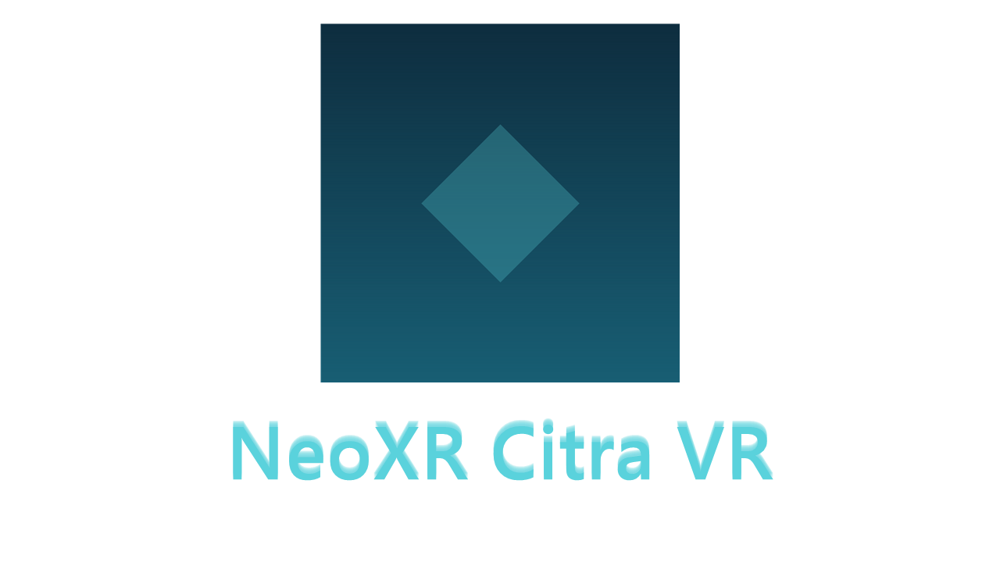

<h1 align="center">
  <br>
  <a href="https://github.com/NeoShadow7366/C_VR_PC_Port"></a>
  <br>
  Sheikah Protocol VR
  <br>
  <sub>An unofficial SteamVR / Windows PC port of <a href="https://github.com/amwatson/CitraVR">CitraVR</a></sub>
  <br>
</h1>

<h4 align="center">
  Play 3DS homebrew and your personal game backups in stereoscopic 3D on any SteamVR headset.
  <br/>
  Built on OpenXR + Vulkan, with no game engine and no proprietary SDKs.
</h4>

<p align="center">
  <a href="#status">Status</a> |
  <a href="#features">Features</a> |
  <a href="#supported-hardware">Hardware</a> |
  <a href="#install--run">Install & Run</a> |
  <a href="#building-from-source">Building</a> |
  <a href="#in-vr-controls">Controls</a> |
  <a href="#troubleshooting">Troubleshooting</a> |
  <a href="#credits">Credits</a> |
  <a href="#license">License</a>
</p>

> **Heads up.** This is an unofficial fork. It is **not** affiliated with the original CitraVR project, the Citra team, or Valve. The upstream CitraVR targets standalone Meta Quest headsets; this fork targets desktop PCVR via SteamVR/OpenXR on Windows.

> **About the author / AI disclosure.** I'm not a professional developer. This fork exists because I wanted a smooth, feature-rich way to play 3DS games on my own PCVR setup (specifically a **Bigscreen Beyond 2** driven by desktop GPU horsepower) and the upstream Quest build couldn't deliver that. The port has been built **with heavy use of AI coding assistants** (GitHub Copilot / Claude) — they wrote a large share of the code, with me directing the work, testing on real hardware, and iterating on what didn't work. Treat this project accordingly: it's a passion-driven personal branch, not a professionally-engineered product. Bugs, rough edges, and questionable design choices are to be expected. PRs and fixes from actual engineers are very welcome.

## Status

Beta. The renderer, in-VR menu, Qt configuration UI, controller bindings, head-tracked gyro/accelerometer, and Steam/SteamVR launcher integration are all working and have been verified on real hardware (Valve Index, Bigscreen Beyond 2). Some features are still rough — see [Known Issues](#known-issues).

## Features

- **Native SteamVR/OpenXR runtime** — no Meta SDK, no third-party game engine, no OpenVR shim.
- **Vulkan rendering** via `XR_KHR_vulkan_enable2`, with a dedicated VkQueue so SteamVR and the Citra renderer don't race.
- **Stereoscopic 3D** with adjustable depth (0–100%) and an Immersive Mode (Off / High / Ultra).
- **In-VR menu** (Dear ImGui on a quad layer) for settings, save states, ROM browser, controller remapping, and quality presets — all without leaving the headset.
- **Wrist-bar quick controls** — Menu / Start / Select buttons floating above the left grip.
- **Head-tracking → gyro/accelerometer** so games that read the 3DS motion sensors (Steel Diver, Zelda OoT 3D camera, etc.) respond to head movement.
- **Per-HMD profile** (`beyond2`, `index`, `vive`, `generic`) — picks the right refresh rate (90/120 Hz cap) automatically.
- **Qt frontend integration** — `citra-qt` gains a "VR" settings tab and an `Emulation → Launch in VR` menu item; settings round-trip through `%APPDATA%\Citra\vr_config.txt`.
- **Steam integration** — Inno Setup installer, SteamVR manifest, and PowerShell helpers to add CitraVR as a Steam shortcut (see [dist/](dist/)).
- **GPLv3, 100% source-available** (this fork and all upstream code).

## Supported Hardware

### HMDs (tested on real hardware)
- Bigscreen Beyond 2

### HMDs (expected to work, not verified by the author)
- Any SteamVR-compatible HMD: Valve Index, Vive (Pro/2/XR), Pimax, Varjo Aero, Quest 2/3/Pro over Link/AirLink/Virtual Desktop with the SteamVR runtime, WMR headsets via the OpenXR-SteamVR bridge. Reports welcome.

### GPU
- A reasonably modern Vulkan-capable GPU. Anything that already runs SteamVR titles smoothly at native HMD resolution should be fine.

### Controllers
- Valve Index Knuckles (primary development target — default bindings assume Knuckles)
- Vive Wands
- Oculus Touch / Quest controllers (via SteamVR)
- The in-VR menu lets you remap any 3DS button to any controller input and persists the bindings.

## Install & Run

The project ships as a single-file Windows installer (**Sheikah Protocol**, built with Inno Setup) that deploys **two** entries and — optionally — registers them as non-Steam shortcuts so they appear in your Steam library with full grid art.

| Entry | Binary | What it does |
| --- | --- | --- |
| **Sheikah Protocol** | `citra-qt.exe` | Flat-screen Citra (3DS emulator) with the Qt UI. |
| **Sheikah Protocol VR** | `citra_vr_launcher.exe` | Tiny shim that starts SteamVR (Steam AppID 250820), waits for `vrserver.exe`, then launches `citra_vr.exe`. |

### Quick start
1. Install [SteamVR](https://store.steampowered.com/app/250820/SteamVR/) and confirm your headset works in SteamVR Home.
2. Install the [Vulkan Runtime](https://vulkan.lunarg.com/sdk/home#windows) (the LunarG redistributable; the full SDK is only needed for building).
3. Download the latest `SheikahProtocol-Setup-<ver>.exe` from the [Releases page](https://github.com/NeoShadow7366/C_VR_PC_Port/releases) and run it.
4. The installer is **per-user** (no admin needed) and installs into `%LOCALAPPDATA%\Programs\SheikahProtocol\`. On the Tasks page you can opt in to:
   - Desktop shortcuts for each entry
   - **Add Sheikah Protocol to your Steam library**
   - **Add Sheikah Protocol VR to your Steam library** *(marked as a VR title — auto-launches SteamVR)*
5. **Restart Steam** once after install. Both entries then appear in your library with capsule / hero / logo / icon art.
6. Click **Sheikah Protocol VR** in Steam → the launcher starts SteamVR (if it isn't already), waits for it to come up, then launches `citra_vr.exe`. Pick a ROM from the in-VR browser and play.

> You will need legally-dumped copies of your own 3DS games. This project does **not** distribute ROMs or system files.

### Alternate launch methods
- `citra-qt.exe` → pick a ROM → **Emulation → Launch in VR**
- `citra-qt.exe --vr` (pops a file picker and launches straight into VR)
- `run_citra_vr.bat` (dev shortcut — edit the `CONFIG` block at the top to set `ROM_PATH`)
- `citra_vr_launcher.exe <rom>` directly

### Steam integration details
- **App IDs** are computed per the non-Steam-shortcut convention (`crc32(quoted_exe + appname) | 0x80000000`), so they match what Steam ROM Manager / SteamGridDB use.
- **`shortcuts.vdf`** is rewritten in Steam's binary VDF format. A `.bak` is created on first write.
- **Grid art** is deployed into `<Steam>\userdata\<id>\config\grid\` with the correct filenames for capsule, small capsule, hero, logo, and icon.
- The VR shortcut sets `OpenVR=1`, which is what gives it the VR badge in your library and keeps the SteamVR status window relevant while the game runs.
- By default the installer writes to the **most recently used** Steam account. You can target all signed-in accounts manually with `dist/steam_integration/Add-SteamShortcuts.ps1 -AllUsers`.
- **Uninstall** removes the program files **and** the Steam shortcuts and grid art.

If you don't want to run the installer, the same scripts can be invoked standalone:
```powershell
# Add the entries to Steam without installing anything
.\dist\steam_integration\Add-SteamShortcuts.ps1

# Remove them later
.\dist\steam_integration\Remove-SteamShortcuts.ps1
```

Full deployment-system documentation: [dist/STEAM_INSTALLER_README.md](dist/STEAM_INSTALLER_README.md).

### Configuration
- VR-specific settings: `%APPDATA%\Citra\vr_config.txt` (or edit them via `citra-qt` → **Configure → VR**).
- Standard Citra settings: `%APPDATA%\Citra\config\qt-config.ini`.
- Crash dumps: `%APPDATA%\Citra\dumps\citra_vr_<timestamp>.dmp` — symbolize with `tools\symbolize.ps1`.

## Building from Source

**Prerequisites (Windows)**
- Visual Studio 2022 (Desktop C++ workload)
- CMake ≥ 3.22
- [Vulkan SDK 1.3+](https://vulkan.lunarg.com/sdk/home#windows)
- Qt 6 (only if you want the `citra-qt` launcher)
- Git with submodule support

```powershell
git clone --recursive https://github.com/NeoShadow7366/C_VR_PC_Port.git
cd C_VR_PC_Port

# VR-only build (citra_vr.exe)
cmake --preset vr
cmake --build --preset vr

# Qt launcher (citra-qt.exe with the "Launch in VR" menu item)
cmake --preset qt
cmake --build --preset qt
```

Output:
- `build-vr\bin\Release\citra_vr.exe` (~20 MB) — the standalone VR runtime
- `build-vr\bin\Release\citra_vr_launcher.exe` — the SteamVR-aware shim used by the Steam shortcut
- `build\bin\Release\citra-qt.exe` — the Qt frontend

A `vr-debug` preset is also available for a debug build (PCH/LTO/W-as-E off).

`sccache` is auto-detected if it's on `PATH` and used as the compiler launcher.

### Building the installer
After both `qt` and `vr` presets have produced their binaries, build the Inno Setup installer (requires [Inno Setup 6](https://jrsoftware.org/isinfo.php) on `PATH` or in `%PROGRAMFILES(X86)%\Inno Setup 6\`):

```powershell
cmake --build build-vr --target sheikah_installer
# or directly:
.\dist\installer\Build-Installer.ps1 -AppVersion 0.1.0
```

Output: `dist\installer\out\SheikahProtocol-Setup-<ver>.exe` (~50 MB). See [dist/STEAM_INSTALLER_README.md](dist/STEAM_INSTALLER_README.md) for the full deployment system.

### Repository layout (VR-specific bits)

| Path | What it is |
| --- | --- |
| `src/citra_vr/` | Standalone `citra_vr.exe` entry point, shutdown handlers, sentinel-restart logic |
| `src/vr_launcher/` | `citra_vr_launcher.exe` — SteamVR-aware shim invoked by the Steam shortcut |
| `src/vr_platform/` | OpenXR session, frame submitter, Vulkan↔XR interop, ImGui menu, cursor / wrist / dim layers, ROM browser, input bridge |
| `src/video_core/renderer_vulkan/vk_vr_hooks.{h,cpp}` | Vulkan instance/device hooks injected via `XR_KHR_vulkan_enable2` |
| `src/citra_qt/configuration/configure_vr.{h,cpp,ui}` | "VR" settings tab in the Qt frontend |
| `src/common/vr_config.{h,cpp}` | Shared `vr_config.txt` reader/writer used by both binaries |
| `dist/installer/` | Inno Setup script + build scripts for the Windows installer |
| `dist/steam_integration/` | PowerShell modules to add/remove Steam shortcuts |
| `dist/steamvr/` | SteamVR manifest + app key registration |
| `tools/symbolize.ps1` | Resolves `citra_vr.exe+0x...` offsets from minidumps |
| `Project artifacts/` | Design notes, plans, and per-subsystem documentation |

## In-VR Controls

Default bindings (remappable via the in-VR menu → **Controls**):

| Action | Default binding |
| --- | --- |
| Open / close menu | Wrist-bar **Menu** button (above left grip) |
| Hold for Home | Long-press the wrist Menu button (700 ms) |
| Start / Select | Wrist-bar Start / Select buttons (point + right trigger), **or** Right System / Left System |
| 3DS A / B | Right A / Right B |
| 3DS X / Y | Left A / Left B |
| D-pad | Left thumbstick (also Index trackpad when touched) |
| Circle Pad | Left thumbstick (analog) |
| C-Stick | Right thumbstick |
| L / R | Left / Right **trigger** |
| ZL / ZR | Left / Right **grip** |
| Touchscreen | Point the **right** controller at the lower half of the screen and pull the trigger |
| Scroll the menu | Right thumbstick (Y axis) |

Cursors are color-coded: **teal** for left hand, **amber** for right.

## Known Issues

- **In-process Load State is disabled** — selecting a save slot relaunches the process via a sentinel file to avoid a renderer-cache destructor AV. Save works in-process; Load uses the relaunch path. (Quick-save before quitting, then quick-load on next launch, works reliably.)
- **SteamVR validation noise** (`PREINITIALIZED` layout, BlankEyeBuffer `SHADER_READ_ONLY_OPTIMAL`) — cosmetic, originates inside SteamVR's compositor; safe to ignore.
- **WMR headsets via the OpenXR-SteamVR bridge** are untested and may need `CITRA_VR_HMD=generic`.
- **No mixed-reality passthrough** on PCVR (was a Quest-only feature upstream).

## Troubleshooting

- Run with `--vk-debug` to enable Vulkan validation layers (or set `CITRA_VR_VK_DEBUG=1`).
- The log lives at `%APPDATA%\Citra\log\citra_log.txt` — the first lines after startup confirm which HMD profile was selected and which `vr_config.txt` values were loaded.
- Force a specific HMD profile with `CITRA_VR_HMD=beyond2|index|vive|generic` (SteamVR's OpenXR `systemName` is just `"SteamVR/OpenXR : lighthouse"`, so auto-detection often falls back to `generic`).
- If a crash drops a `.dmp` in `%APPDATA%\Citra\dumps\`, run the **Symbolize Crash Dump** VS Code task or invoke `tools\symbolize.ps1 -Exe build-vr\bin\Release\citra_vr.exe -Offsets @(0x...)` directly.

## Contributing

Issues and PRs are welcome on this fork. For changes that also make sense upstream (Quest version), please also consider opening a PR against [amwatson/CitraVR](https://github.com/amwatson/CitraVR).

CI runs Windows VR + Qt builds plus a headless smoke test on every push — see [.github/workflows/windows-vr-qt.yml](.github/workflows/windows-vr-qt.yml).

## Credits

This project would not exist without:

- **[CitraVR](https://github.com/amwatson/CitraVR)** by [@amwatson](https://github.com/amwatson) — the original OpenXR port of Citra to Meta Quest. All of the hard rendering and 3DS-emulation-in-VR ground was broken there.
- **[Citra](https://github.com/citra-emu/citra)** and the [PabloMK7/citra](https://github.com/PabloMK7/citra) fork — the underlying 3DS emulator.
- **Khronos Group** — OpenXR, Vulkan, glslang, Vulkan-Headers, VMA.
- **Dear ImGui** by [@ocornut](https://github.com/ocornut) — the in-VR menu UI.
- **Valve** — SteamVR / OpenXR runtime.
- All upstream Citra third-party dependencies (SDL, cubeb, dynarmic, openal-soft, libusb, libressl, …) — full attributions in [NOTICE](NOTICE) and [license.txt](license.txt).

## License

CitraVR (and this fork) is licensed under the **GNU General Public License v3.0 or later**.
See [license.txt](license.txt) and [NOTICE](NOTICE) for full terms and third-party attributions.
